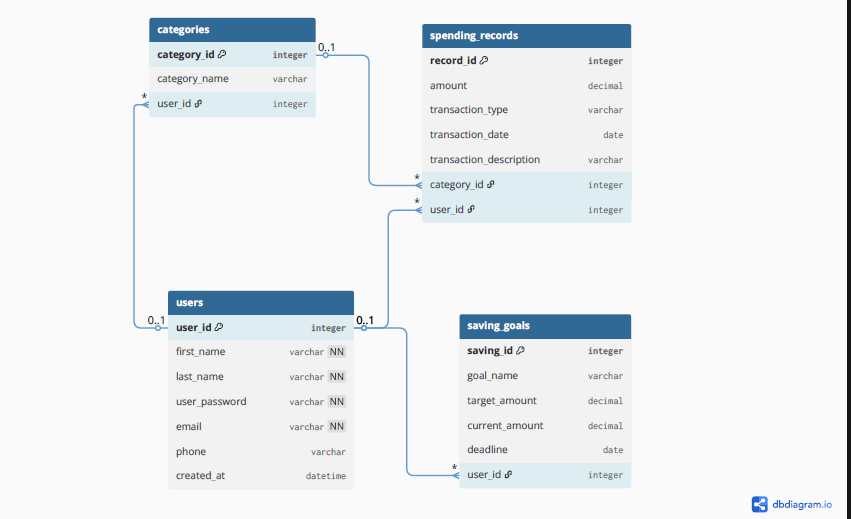

# 💰 Budget Tracker Database

A relational database system designed to help users track their income, expenses, savings goals, and spending categories. Built with MySQL as part of a personal portfolio project.

---

## 📌 Project Overview

This project demonstrates core database design and SQL skills including:
- Entity-Relationship (ER) design
- Table creation with constraints and foreign keys
- Data insertion and manipulation
- SQL queries including JOINs, aggregations, and calculations

---

## 🗂️ Database Schema

The database consists of 4 tables:

### `users`
Stores user account information.
| Column | Type | Description |
|--------|------|-------------|
| user_id | INT (PK) | Unique user identifier |
| first_name | VARCHAR(50) | User's first name |
| last_name | VARCHAR(50) | User's last name |
| user_password | VARCHAR(300) | Hashed password |
| email | VARCHAR(100) | Unique email address |
| phone | VARCHAR(15) | Phone number |
| created_at | DATETIME | Account creation timestamp |

### `categories`
Stores spending categories per user (e.g. Groceries, Airtime, Clothes).
| Column | Type | Description |
|--------|------|-------------|
| category_id | INT (PK) | Unique category identifier |
| category_name | VARCHAR(100) | Name of the category |
| user_id | INT (FK) | References users(user_id) |

### `spending_records`
Records every income or expense transaction.
| Column | Type | Description |
|--------|------|-------------|
| record_id | INT (PK) | Unique record identifier |
| amount | DECIMAL(10,2) | Transaction amount |
| transaction_type | ENUM | Either 'income' or 'expense' |
| transaction_date | DATE | Date of transaction |
| transaction_description | VARCHAR(300) | Description of transaction |
| category_id | INT (FK) | References categories(category_id) |
| user_id | INT (FK) | References users(user_id) |

### `saving_goals`
Tracks savings goals and progress for each user.
| Column | Type | Description |
|--------|------|-------------|
| saving_id | INT (PK) | Unique goal identifier |
| goal_name | VARCHAR(100) | Name of the savings goal |
| target_amount | DECIMAL(10,2) | Target amount to save |
| current_amount | DECIMAL(10,2) | Amount saved so far |
| deadline | DATE | Target date to reach goal |
| user_id | INT (FK) | References users(user_id) |

---

## 🔗 Entity Relationships

- One **user** can have many **categories**
- One **user** can have many **spending records**
- One **user** can have many **saving goals**
- One **category** can be linked to many **spending records**

  Below is an ER diagram
  

---

## 📊 Sample Queries

### View all expenses
```sql
SELECT * FROM spending_records
WHERE transaction_type = 'expense';
```

### Total amount spent per user
```sql
SELECT first_name, last_name, SUM(amount) AS total_spent
FROM users
JOIN spending_records ON users.user_id = spending_records.user_id
WHERE transaction_type = 'expense'
GROUP BY first_name, last_name;
```

### View transactions with user and category details
```sql
SELECT first_name, category_name, transaction_description, amount
FROM users
JOIN spending_records ON users.user_id = spending_records.user_id
JOIN categories ON spending_records.category_id = categories.category_id;
```

### Savings goal progress
```sql
SELECT goal_name, target_amount, current_amount,
ROUND((current_amount / target_amount) * 100, 2) AS progress_percentage
FROM saving_goals;
```

---

## 🚀 How to Run

1. Make sure you have **MySQL** installed and running
2. Open **MySQL Workbench** or any MySQL client
3. Open the file `budget_tracker.sql`
4. Run the full script
5. The database `budget_tracker_db` will be created automatically

---

## 🛠️ Technologies Used

- MySQL 8.0
- MySQL Workbench

---

## 👩‍💻 Author

**Chrishelda Seopa**  
2nd Year Computer Science Student  
University of Venda  
🔗 [GitHub](https://github.com/25040757) | [LinkedIn](https://www.linkedin.com/in/Lesetja_Chrishelda)

---

## 📄 License

This project is open source and available under the [MIT License](LICENSE).
